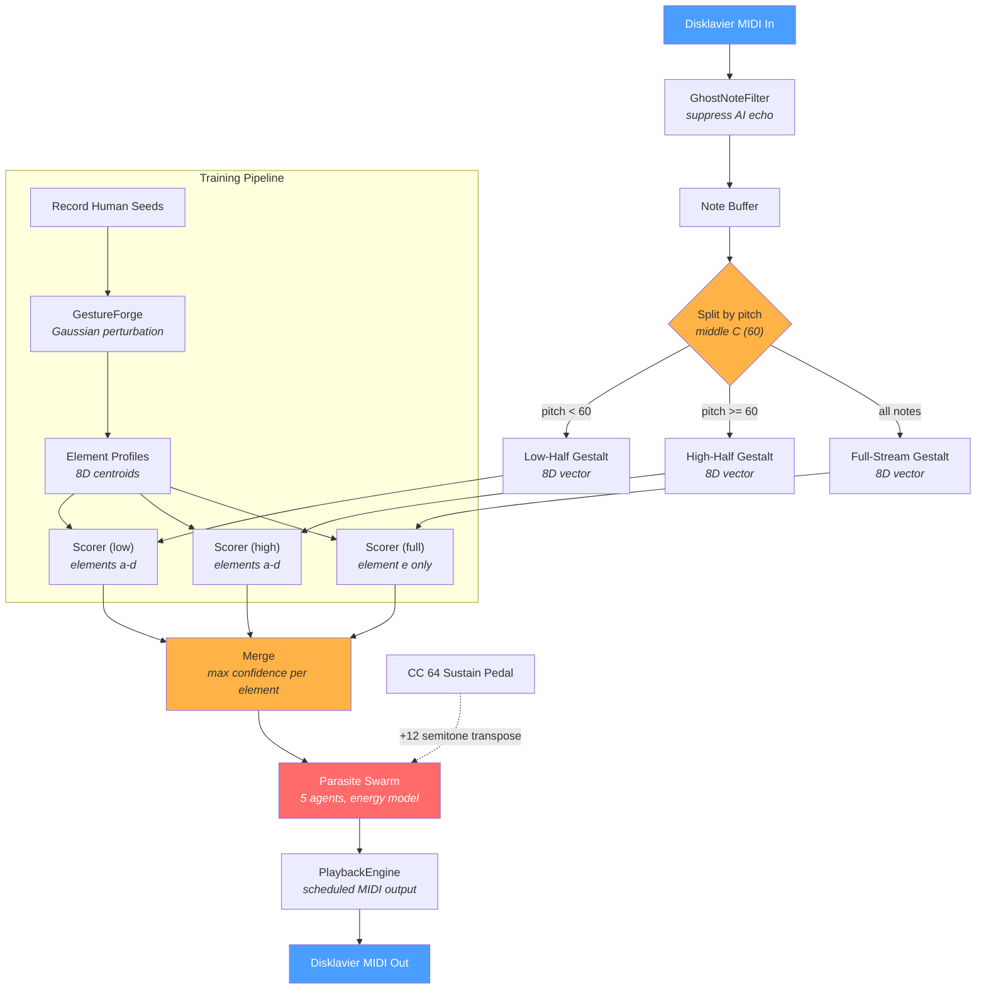

# Abeyance II

Real-time computer-music interface for the Yamaha Disklavier. A performer's gestures are classified into five overlapping elements via ML; a "Parasite Swarm" generates autonomous MIDI responses back into the piano. The system studies cognitive channel capacity and attentional overload in live musical interaction.

Built as part of a master's thesis investigating how many simultaneous gesture-response channels a performer can track before experiencing cognitive saturation (Miller, 1956; Cowan, 2001; Pylyshkin & Storm, 1988; Wickens, 2002; Bregman, 1990).

## Architecture



## 5-Element Taxonomy

| ID | Name | Frame | Scoring | Gesture | Response |
|----|------|-------|---------|---------|----------|
| **a** | Linear Velocity | 250ms | affinity | Runs, scales, sweeps | Counter-motion in neighboring register |
| **b** | Vertical Density | 150ms | chord | Dense simultaneous chords | Sustained cluster resonance |
| **c** | Transposed Shapes | 600ms | affinity | Interval shapes shifting registers | Tritone echo (+6 semitones) |
| **d** | Oscillation | 500ms | affinity | Trills, tremolo, alternation | Phase-shifted trill at offset rate |
| **e** | Extreme Registers | 350ms | affinity | Both keyboard extremes | Fill the gap: gentle middle-register notes |

Each element has its own dynamic mapping (compressed/inverse/direct/expanded/averaged) transforming input velocity to output velocity. Detection is **dynamics-neutral** (the 8D vector excludes MIDI velocity); response is **dynamics-aware**.

## Split-Keyboard Detection

The keyboard is split at middle C. Elements a-d are scored independently on each half, enabling pseudo-polyphonic detection -- e.g., scales in the left hand and clusters in the right hand activate both elements simultaneously. Element E always scores on the full stream since it relies on the gap between both keyboard extremes.

## 8D Gestalt Vector

Each analysis frame is compressed into an 8-dimensional feature vector:

```
[density, polyphony, spread, variance, up_velocity, down_velocity, articulation, bimodality]
```

All values normalized 0-1. MIDI velocity intentionally excluded. Computed per-element using each element's own temporal window.

## Setup

### Requirements

- Python 3.8+
- Yamaha Disklavier (or any MIDI I/O device; falls back to dummy mode)
- tkinter (included with Python on most platforms)

### Install

```bash
pip install -r requirements.txt
```

### Run

```bash
python main.py
```

### Test

```bash
python -m unittest discover tests -v
```

## Recording and Training

Recording and training are separate steps, each controlled per-element via the GUI:

1. **REC** -- play the gesture you want to teach. Press again to stop. Repeatable; seeds accumulate across takes.
2. **TRAIN** -- forge synthetic variations from recorded seeds via Gaussian perturbation, then retrain the element profile.
3. **CLR** -- reset an element to its hardcoded default centroid.

Silent frames are auto-stripped during recording.

## Session Logs

Performance data is saved to `sessions/session_*.json` with four sections: `metadata`, `summary`, `frames`, `attacks`. Compact digest files (`*.digest.json`, ~5% size) are auto-generated for analysis.

## Project Structure

See [`docs/DIRECTORY.md`](docs/DIRECTORY.md) for the full file map.

## Theoretical Framework

See [`docs/RESEARCH_NOTES.md`](docs/RESEARCH_NOTES.md) for the cognitive science background (Miller, Cowan, Pylyshkin, Wickens, Bregman).

## License

All rights reserved.
